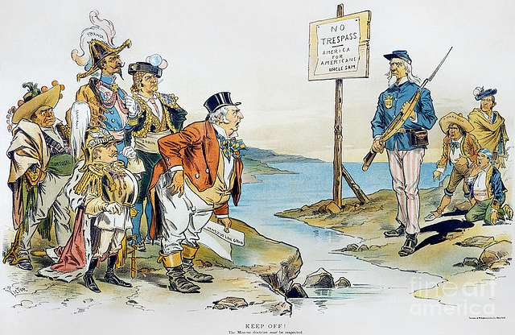

## U.S Imperialism
1. Imperialism is the ideology of extending the rule of a country over other countries and people often by military force or by gaining political and economic control.

**The U.S becomes a world power at the turn of the 20th century**

2. From the civil war until the 1890's most Americans had little interest in territorial expansion. **What changed all of this?**

**The New Imperialism**

3. 1870-1900 European scramble for empires America might be shut out of global markets and raw materials

**Social Darwinism**

4. Countries that failed to complete were doomed America nad become increasingly dependent on foreign trade. 

5. U.S needed foreign territoy for noval bases and coaling stations belief that prosperity dependent on a large navy and control of the sea.

**Background "The Monroe Doctrine 1823"**

6. Revolutions against spanish and french rule in latin America 

7. U.S fear that spain and other European policy:

    * A mostly passive commitment to keep European countries out of Latin America Motive 

    * Keep U.S interest in latin America safe from European conflicts have 

    * European colonization in the America is over (Go Home) 

    **Main issue: Cuba struggle for independence against spain.**
    
    Americans heard sensational stories about spains treatment of Cuban rebels. 
    
    >BREAKING POINT: U.S battleship - The Maine was sunk in havana harbor it was an accident but the U.S blamed Spain 

    **Fighting in the Pacific and the carribbian** 

    8. U.S noval power was decisive. We had the 3rd largest navy.

    9. Commadore Dewey defeated the spanish fleet in manita bay 

    **Impact of the war**

    10. The defeat and collapse of the spanish empire shocked spain, this 10 week war had a huge impact on the U.S 

    The U.S became an international power.

