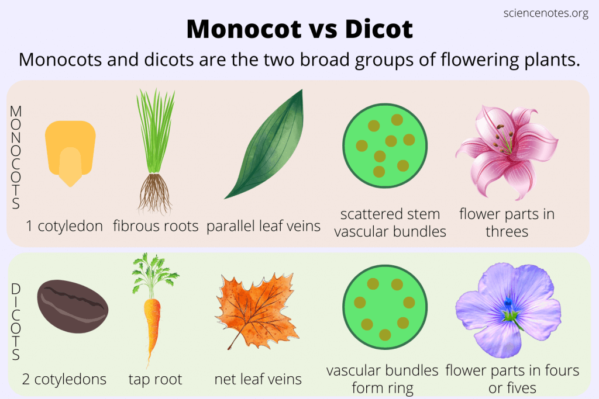

# Monocot vs Dicot
### Seeds 
  | Cotyledons | Roots | Venation | Vascular Bundles|Flowers|
  |------------|-------|-----------|----------------|--------|

  

  #### **Cotyledons**: A cotyledron is a part of an embryo in the seed. At times when the seed begins to grow the cotyledon could be the first leaves. 

  Mono Ex.       
  
